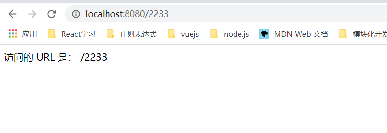

<b>1. vue服务端渲染原理</b>

通过Webpack打包生成两份bundle文件：

+ Client Bundle，给浏览器用。和纯Vue前端项目Bundle类似
+ Server Bundle，供服务端SSR使用，一个json文件

不管你项目先前是什么样子，是否是使用vue-cli生成的。都会有这个构建改造过程。在构建改造这里会用到 vue-server-renderer 库，这里要注意的是 vue-server-renderer 版本要与Vue版本一样。


<b>2. 项目初始化</b>

2.1 vue-cli初始化项目
  1. 全局安装vue-cli3.0
```javascript
npm install @vue/cli
```
  2. 创建一个vue项目
```javascript
vue create vue-ssr-node-blog
```
然后根据需要，选择相应的插件，一步步回车就行。执行npm serve之后，就可以启动项目，不过这个是客户端的使用方式，下面进行ssr改造；

2.2 ssr改造
  1. 安装相关的依赖包
```javascript
yarn add vue-server-renderer --save-dev
yarn add koa --save
```
  2. 在根目录下新建serve.js，模仿官网与服务端集成的代码
```javascript
// server.js
// 第 1 步：创建一个 Vue 实例
const Vue = require("vue");

const Koa = require("koa");
const app = new Koa();
// 第 2 步：创建一个 renderer
const renderer = require("vue-server-renderer").createRenderer();


// 第 3 步：添加一个中间件来处理所有请求
app.use(async (ctx) => {
  const vm = new Vue({
    data: {
      url: ctx.url
    },
    template: `<div>访问的 URL 是： {{ url }}</div>`
  });
  // 将 Vue 实例渲染为 HTML
  renderer.renderToString(vm, (err, html) => {
    if(err){
      ctx.res.status(500).end('Internal Server Error')
      return
    }
    ctx.body = `
      <!DOCTYPE html>
      <html lang="en">
        <head><title>Hello</title></head>
        <body>${html}</body>
      </html>
    `
  });
});

app.listen(8080, () => console.log(`serve run in 8080`));
```
  3. 运行node serve.js后
;

2.3 使用页面模板
  1. 在src目录下新建index.template.html模板(注意 <!--vue-ssr-outlet--> 注释 -- 这里将是应用程序 HTML 标记注入的地方。)
```html
<!DOCTYPE html>
<html lang="en">
  <head><title>vue-ssr-node-blog</title></head>
  <body>
    <!--vue-ssr-outlet-->
  </body>
</html>
```
  2. 修改serve.js代码
```javascript
// server.js
// 第 1 步：创建一个 Vue 实例
const Vue = require("vue");
const Koa = require("koa");
const app = new Koa();
const path = require('path');
const template = require('fs').readFileSync(path.join(__dirname,'src/index.template.html'), 'utf-8');
// 第 2 步：创建一个 renderer
const renderer = require('vue-server-renderer').createRenderer({
  template
});
// 第 3 步：添加一个中间件来处理所有请求
app.use(async (ctx) => {
  const vm = new Vue({
    data: {
      url: ctx.url
    },
    template: `<div>访问的 URL 是： {{ url }}</div>`
  });
  // 将 Vue 实例渲染为 HTML
  renderer.renderToString(vm, (err, html) => {
    if(err){
      ctx.res.status(500).end('Internal Server Error')
      return
    }
    ctx.body = html;
  });
});

app.listen(8080, () => console.log(`serve run in 8080`));
```