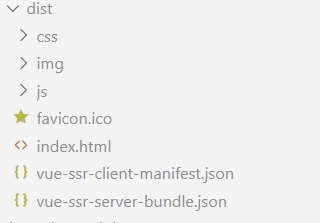
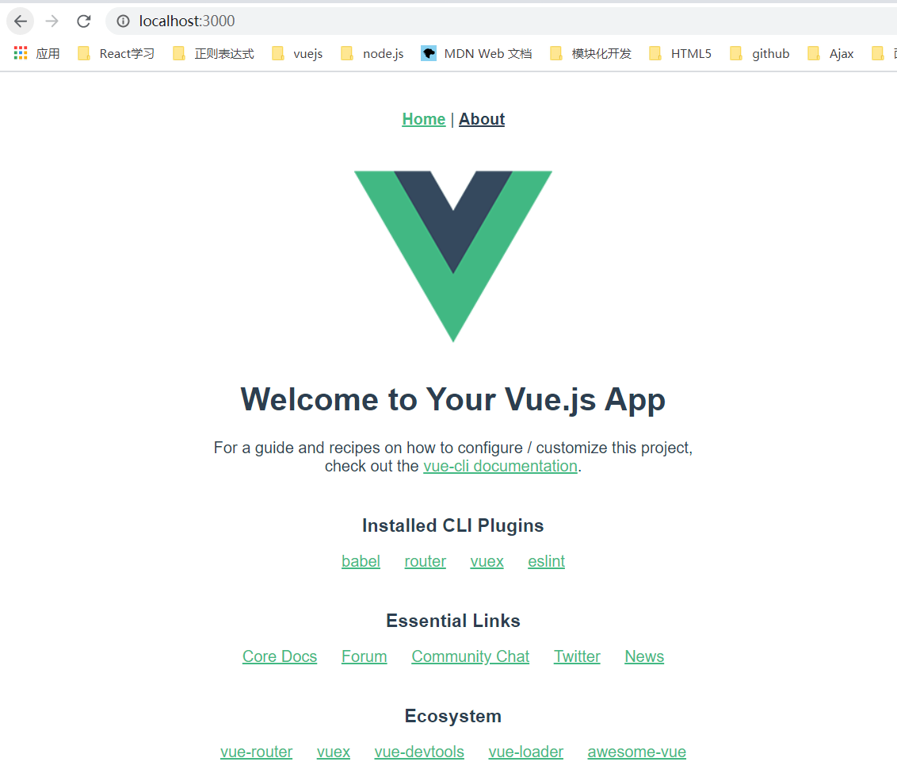

<b>1. 修改项目结构</b>
+ 在src目录下新建两个文件，一个entry-client.js 仅运行于浏览器 一个entry-server.js 仅运行于服务器
+ 修改main.js

```
|——src
|  |——componets
|  |——entry-client.js
|  |——entry-server.js
└── main.js
```

main.js 是我们应用程序的「通用 entry」。在纯客户端应用程序中，我们将在此文件中创建根 Vue 实例，并直接挂载到 DOM。但是，对于服务器端渲染(SSR)，责任转移到纯客户端 entry 文件。mainp.js 简单地使用 export 导出一个 createApp 函数
```javascript
import Vue from 'vue';
import App from './App.vue';

// 导出一个工厂函数，用于创建新的
// 应用程序、router 和 store 实例
export function createApp () {
  const app = new Vue({
    // 根实例简单的渲染应用程序组件。
    render: h => h(App)
  })
  return { app }
}
```

entry-client.js只需创建应用程序，并且将其挂载到 DOM 中：
```javascript
import { createApp } from './main';

// 客户端特定引导逻辑……

const { app } = createApp();

// 这里假定 App.vue 模板中根元素具有 `id="app"`
app.$mount('#app');
```

entry-server.js 使用 export default 导出函数，并在每次渲染中重复调用此函数。此时，除了创建和返回应用程序实例之外，它不会做太多事情 - 但是稍后我们将在此执行服务器端路由匹配 (server-side route matching) 和数据预取逻辑 (data pre-fetching logic)。
```javascript
import { createApp } from './main'

// eslint-disable-next-line no-unused-vars
export default context => {
  const { app } = createApp()
  return app;
}
```
<b>2. 修改路由</b>

修改router下面的inde.js。注意，类似于 createApp，我们也需要给每个请求一个新的 router 实例，所以文件导出一个 createRouter 函数：
```javascript
// router.js
import Vue from 'vue'
import Router from 'vue-router'

Vue.use(Router)

export function createRouter () {
  return new Router({
    mode: 'history',
    routes: [
      { path: '/', component: () => import('../views/Home.vue') },
      { path: '/about', component: () => import('../views/About.vue') },
    ]
  })
}
```
更新main.js
```javascript
// main.js
import Vue from 'vue'
import App from './App.vue'
import { createRouter } from './router'

export function createApp () {
  // 创建 router 实例
  const router = createRouter()

  const app = new Vue({
    // 注入 router 到根 Vue 实例
    router,
    render: h => h(App)
  })

  // 返回 app 和 router
  return { app, router }
}
```
现在我们需要在 entry-server.js 中实现服务器端路由逻辑 (server-side routing logic)：
```javascript
// entry-server.js
import { createApp } from './main'

export default context => {
  // 因为有可能会是异步路由钩子函数或组件，所以我们将返回一个 Promise，
    // 以便服务器能够等待所有的内容在渲染前，
    // 就已经准备就绪。
  return new Promise((resolve, reject) => {
    const { app, router } = createApp()

    // 设置服务器端 router 的位置
    router.push(context.url)

    // 等到 router 将可能的异步组件和钩子函数解析完
    router.onReady(() => {
      const matchedComponents = router.getMatchedComponents()
      // 匹配不到的路由，执行 reject 函数，并返回 404
      if (!matchedComponents.length) {
        return reject({ code: 404 })
      }

      // Promise 应该 resolve 应用程序实例，以便它可以渲染
      resolve(app)
    }, reject)
  })
}
```
<b>3. 修改webpack配置</b>

在vue-cli3创建的vue项目，已经没有了之前的webpack.base.conf.js、webpack.dev.conf.js、webpack.prod.conf.js。根据vue-clic的介绍，需要新建vue.config.js文件，利用configureWebpack 选项提供一个对象，该对象将会被 webpack-merge 合并入最终的 webpack 配置。

1. 在项目根目录下，新建一个vue.config.js

  安装相关依赖
  ```javascript
  yarn add lodash.merge webpack-node-externals cross-env --save-dev
  ```
  配置vue.config.js
  ```javascript
  const VueSSRServerPlugin = require("vue-server-renderer/server-plugin");
  const VueSSRClientPlugin = require("vue-server-renderer/client-plugin");
  const nodeExternals = require("webpack-node-externals");
  const merge = require("lodash.merge");
  const TARGET_NODE = process.env.WEBPACK_TARGET === "node";
  const target = TARGET_NODE ? "server" : "client";

  module.exports = {
    css: {
      extract: process.env.NODE_ENV === "production",
    },
    configureWebpack: () => ({
      // 将 entry 指向应用程序的 server / client 文件
      entry: `./src/entry-${target}.js`,
      // 对 bundle renderer 提供 source map 支持
      devtool: "source-map",
      target: TARGET_NODE ? "node" : "web",
      node: TARGET_NODE ? undefined : false,
      output: {
        libraryTarget: TARGET_NODE ? "commonjs2" : undefined,
      },
      // https://webpack.js.org/configuration/externals/#function
      // https://github.com/liady/webpack-node-externals
      // 外置化应用程序依赖模块。可以使服务器构建速度更快，
      // 并生成较小的 bundle 文件。
      externals: TARGET_NODE
        ? nodeExternals({
            // 不要外置化 webpack 需要处理的依赖模块。
            // 你可以在这里添加更多的文件类型。例如，未处理 *.vue 原始文件，
            // 你还应该将修改 `global`（例如 polyfill）的依赖模块列入白名单
            whitelist: [/\.css$/],
          })
        : undefined,
      optimization: {
        splitChunks: TARGET_NODE ? false : false,
      },
      plugins: [
        TARGET_NODE ? new VueSSRServerPlugin() : new VueSSRClientPlugin(),
      ],
    }),
    chainWebpack: (config) => {
      config.module
        .rule("vue")
        .use("vue-loader")
        .tap((options) => {
          merge(options, {
            optimizeSSR: false,
          });
        });

      // fix ssr hot update bug
      if (TARGET_NODE) {
        config.plugins.delete("hmr");
      }
    },
  };
  ```
2. 修改package，新增三个脚本来生成bundle.json
  ```javascript
  "build:client": "vue-cli-service build",
  "build:server": "cross-env WEBPACK_TARGET=node vue-cli-service build --mode server",
  "build:win": "npm run build:server && move dist\\vue-ssr-server-bundle.json bundle && npm run build:client && move bundle dist\\vue-ssr-server-bundle.json",
  ```
3. 执行npm run build:win生成如下文件



4. 改造server.js 代码

  安装相关依赖
  ```javascript
  yarn add koa-static --save-dev
  ```
  修改sever.js
   ```javascript
  const fs = require("fs");
  const Koa = require("koa");
  const path = require("path");
  const koaStatic = require("koa-static");
  const app = new Koa();

  const resolve = (file) => path.resolve(__dirname, file);
  // 开放dist目录
  app.use(koaStatic(resolve("./dist")));

  // 第 2 步：获得一个createBundleRenderer
  const { createBundleRenderer } = require("vue-server-renderer");
  const bundle = require("./dist/vue-ssr-server-bundle.json");
  const clientManifest = require("./dist/vue-ssr-client-manifest.json");

  const renderer = createBundleRenderer(bundle, {
    runInNewContext: false,
    template: fs.readFileSync(resolve("./src/index.template.html"), "utf-8"),
    clientManifest: clientManifest,
  });

  function renderToString(context) {
    return new Promise((resolve, reject) => {
      renderer.renderToString(context, (err, html) => {
        err ? reject(err) : resolve(html);
      });
    });
  }
  // 第 3 步：添加一个中间件来处理所有请求
  // eslint-disable-next-line no-unused-vars
  app.use(async (ctx, next) => {
    const context = {
      title: "ssr test",
      url: ctx.url,
    };
    // 将 context 数据渲染为 HTML
    const html = await renderToString(context);
    ctx.body = html;
  });

  const port = 3000;
  app.listen(port, function() {
    console.log(`server started at localhost:${port}`);
  });
  ```

5. 运行node serve.js

;
