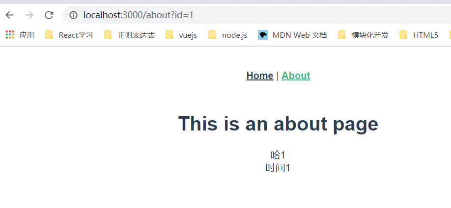
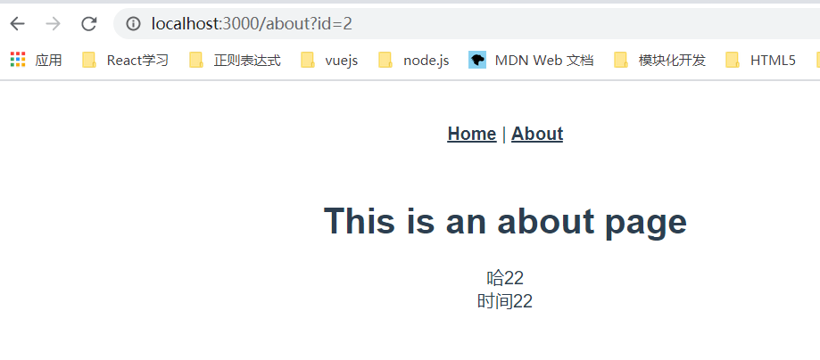

## <b>集成vuex</b>

1.<b>修改store下面的index.js</b>
```javascript
// store.js
import Vue from "vue";
import Vuex from "vuex";

Vue.use(Vuex);

// 假定我们有一个可以返回 Promise 的
// 通用 API（请忽略此 API 具体实现细节）
import { fetchItem } from "../api";

export function createStore() {
  return new Vuex.Store({
    state: {
      items: {},
    },
    actions: {
      fetchItem({ commit }, id) {
        // `store.dispatch()` 会返回 Promise，
        // 以便我们能够知道数据在何时更新
        return fetchItem(id).then((item) => {
          commit("setItem", { id, item });
        });
      },
    },
    mutations: {
      setItem(state, { id, item }) {
        Vue.set(state.items, id, item);
      },
    },
  });
}
```
```javascript
// api文件夹下面的index.js
export const fetchItem = (id) => {
  return new Promise((resolve) => {
    setTimeout(() => {
      let obj = {
        1: [{title: '哈1'}, {title: '时间1'}],
        2: [{title: '哈22'}, {title: '时间22'}],
      }
      let res = obj[id] || [{title: '大多数'}]
      resolve(res);
    }, 1000);
  })
}
```
2.<b>修改 main.js</b>
```javascript
// main.js
import Vue from "vue";
import App from "./App.vue";
import { createRouter } from "./router";
import { createStore } from "./store";
import { sync } from "vuex-router-sync";

export function createApp() {
  // 创建 router 和 store 实例
  const router = createRouter();
  const store = createStore();

  // 同步路由状态(route state)到 store
  sync(store, router);

  // 创建应用程序实例，将 router 和 store 注入
  const app = new Vue({
    router,
    store,
    render: (h) => h(App),
  });

  // 暴露 app, router 和 store。
  return { app, router, store };
}
```
3.<b>修改组件</b>

组件里面暴露出一个自定义静态函数 asyncData。注意，由于此函数会在组件实例化之前调用，所以它无法访问 this。需要将 store 和路由信息作为参数传递进去：
```javascript
// About.vue
<template>
  <div class="about">
    <h1>This is an about page</h1>
    <div v-for="(item, index) in items" :key="index">{{ item.title }}</div>
  </div>
</template>

<script>
export default {
  asyncData ({ store, route }) {
    // 触发 action 后，会返回 Promise
    return store.dispatch('fetchItem', route.query.id)
  },
  computed: {
    // 从 store 的 state 对象中的获取 item。
    items () {
      return this.$store.state.items[this.$route.query.id]
    }
  }
}
</script>
```
4.<b>服务器端数据预取</b>

在 entry-server.js 中，我们可以通过路由获得与 router.getMatchedComponents() 相匹配的组件，如果组件暴露出 asyncData，我们就调用这个方法。然后我们需要将解析完成的状态，附加到渲染上下文(render context)中。
```javascript
// entry-server.js
import { createApp } from "./main";

export default (context) => {
  return new Promise((resolve, reject) => {
    const { app, router, store } = createApp();

    router.push(context.url);

    router.onReady(() => {
      const matchedComponents = router.getMatchedComponents();
      if (!matchedComponents.length) {
        return reject({ code: 404 });
      }

      // 对所有匹配的路由组件调用 `asyncData()`
      Promise.all(
        matchedComponents.map((Component) => {
          if (Component.asyncData) {
            return Component.asyncData({
              store,
              route: router.currentRoute,
            });
          }
        })
      )
        .then(() => {
          // 在所有预取钩子(preFetch hook) resolve 后，
          // 我们的 store 现在已经填充入渲染应用程序所需的状态。
          // 当我们将状态附加到上下文，
          // 并且 `template` 选项用于 renderer 时，
          // 状态将自动序列化为 `window.__INITIAL_STATE__`，并注入 HTML。
          context.state = store.state;

          resolve(app);
        })
        .catch(reject);
    }, reject);
  });
};
```
5.<b>客户端数据预取</b>

在客户端，处理数据预取有两种不同方式:

a.在路由导航之前解析数据：
使用此策略，应用程序会等待视图所需数据全部解析之后，再传入数据并处理当前视图。好处在于，可以直接在数据准备就绪时，传入视图渲染完整内容，但是如果数据预取需要很长时间，用户在当前视图会感受到"明显卡顿"。因此，如果使用此策略，建议提供一个数据加载指示器 (data loading indicator)。

我们可以通过检查匹配的组件，并在全局路由钩子函数中执行 asyncData 函数，来在客户端实现此策略。注意，在初始路由准备就绪之后，我们应该注册此钩子，这样我们就不必再次获取服务器提取的数据。
```javascript
// entry-client.js
import { createApp } from "./main";

const { app, router, store } = createApp();

if (window.__INITIAL_STATE__) {
  store.replaceState(window.__INITIAL_STATE__);
}

router.onReady(() => {
  // 添加路由钩子函数，用于处理 asyncData.
  // 在初始路由 resolve 后执行，
  // 以便我们不会二次预取(double-fetch)已有的数据。
  // 使用 `router.beforeResolve()`，以便确保所有异步组件都 resolve。
  router.beforeResolve((to, from, next) => {
    const matched = router.getMatchedComponents(to);
    const prevMatched = router.getMatchedComponents(from);

    // 我们只关心非预渲染的组件
    // 所以我们对比它们，找出两个匹配列表的差异组件
    let diffed = false;
    const activated = matched.filter((c, i) => {
      return diffed || (diffed = prevMatched[i] !== c);
    });

    if (!activated.length) {
      return next();
    }

    // 这里如果有加载指示器 (loading indicator)，就触发

    Promise.all(
      activated.map((c) => {
        if (c.asyncData) {
          return c.asyncData({ store, route: to });
        }
      })
    )
      .then(() => {
        // 停止加载指示器(loading indicator)

        next();
      })
      .catch(next);
  });

  app.$mount("#app");
});
```
b.匹配要渲染的视图后，再获取数据：
此策略将客户端数据预取逻辑，放在视图组件的 beforeMount 函数中。当路由导航被触发时，可以立即切换视图，因此应用程序具有更快的响应速度。然而，传入视图在渲染时不会有完整的可用数据。因此，对于使用此策略的每个视图组件，都需要具有条件加载状态。

这可以通过纯客户端 (client-only) 的全局 mixin 来实现：
```javascript
// main.js
Vue.mixin({
  beforeMount () {
    const { asyncData } = this.$options
    if (asyncData) {
      // 将获取数据操作分配给 promise
      // 以便在组件中，我们可以在数据准备就绪后
      // 通过运行 `this.dataPromise.then(...)` 来执行其他任务
      this.dataPromise = asyncData({
        store: this.$store,
        route: this.$route
      })
    }
  }
})
```
这两种策略是根本上不同的用户体验决策，应该根据你创建的应用程序的实际使用场景进行挑选。但是无论你选择哪种策略，当路由组件重用（同一路由，但是 params 或 query 已更改，例如，从 user/1 到 user/2）时，也应该调用 asyncData 函数。我们也可以通过纯客户端 (client-only) 的全局 mixin 来处理这个问题：
```javascript
// main.js
Vue.mixin({
  beforeRouteUpdate (to, from, next) {
    const { asyncData } = this.$options
    if (asyncData) {
      asyncData({
        store: this.$store,
        route: to
      }).then(next).catch(next)
    } else {
      next()
    }
  }
})
```

5.<b>展示结果</b>

重新执行下面指令
```javascript
npm run build:win
node serve.js  
```

运行结果

